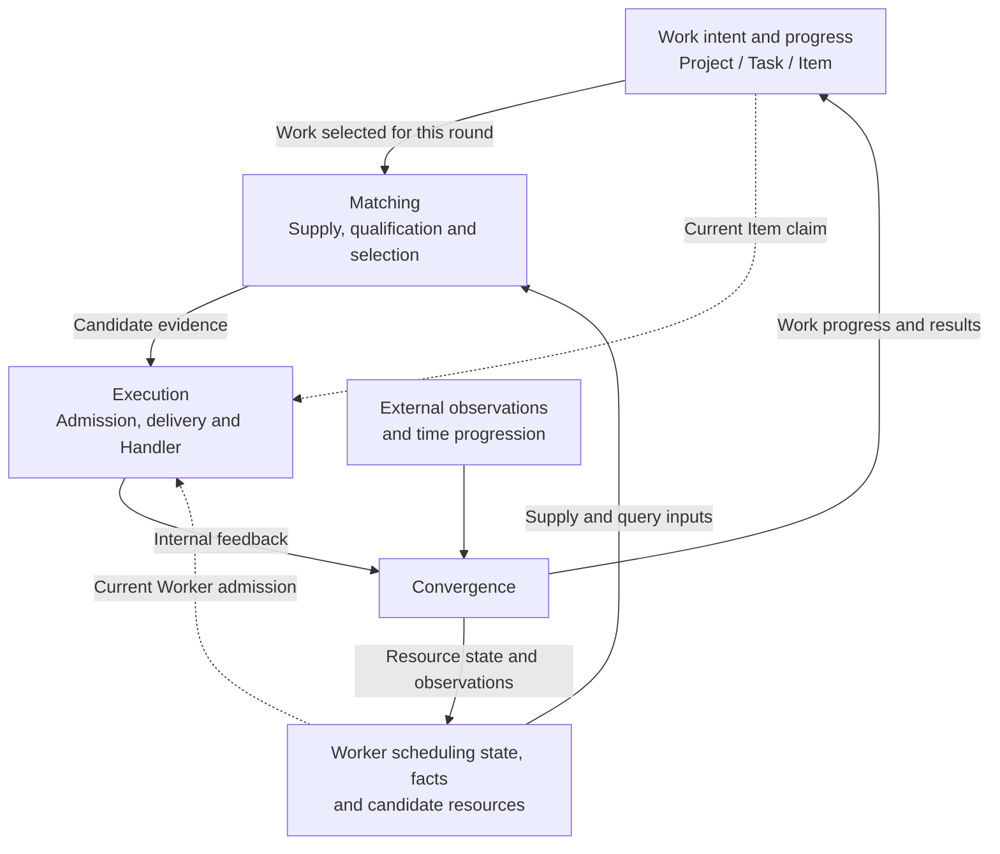

# Kernel Scheduling Mainline

Status: current system behavior model, cross-owner scheduling flow and scale boundary.

XA Mass is a closed-loop execution Runtime for heterogeneous, changing Workers.
It connects business work with resources under explicit scheduling and execution
authority, and uses execution feedback and external observations to update work
progress and subsequent resource selection. This page owns the complete
Matching / Execution / Convergence model and its mapping to implementation owners.
The [Kernel index](README.md) links the local contracts; encoding, individual
round limits and legal transitions stay with those owners.

## System Behavior Model

There are two connected lines of state:

- **Work:** Project provides business attribution; Task and TaskItem describe
  work, scheduling progress, retries and termination. Retained Items can receive
  later business observations after their scheduling has ended.
- **Resources:** Workers have scheduling coordinates, observed facts and business
  context. Pools retain finite candidate evidence; indexes provide lookup from
  accepted facts. Connection evidence, qualification and execution availability
  each retain their own meaning.

Both lines are first-class: heterogeneous Worker capabilities and context make
resource selection distinctive, while Task/Item progress, retry, termination
and results remain independent responsibilities.

The current [Project contract](../../server_jvm/README.md#profile-projects-and-managed-tasks)
provides business attribution, configured Group associations and managed Task
entrypoints. Projects do not partition Kernel scheduling or Matching stock;
they do not own the Pools or query strategies used by their Tasks. Broader
Project ideas are possible evolution, not implied current authority.

Task/Item scheduling decides which work enters a round. Matching supplies
candidates for that work. Execution attempts the pairing, and Convergence
feeds changes back into both work progress and resource state.

| Behavioral domain | Question | Responsibility |
| --- | --- | --- |
| Matching | Which Worker may this work attempt? | Organize supply and qualification, maintain candidate stock, and select candidates through Pool or direct queries. |
| Execution | How does a candidate become an execution attempt? | Obtain current execution authority, claim the Item, deliver the Command and invoke the Worker Handler. |
| Convergence | How does what happened affect subsequent decisions? | Interpret internal feedback and external observations, and apply the appropriate updates to scheduling state, facts, results and business/resource observations. |



The arrows describe responsibilities and effects across existing owners, not
one synchronous call chain or an atomic system snapshot. The domains operate
throughout the Runtime: supply can proceed separately from dispatch, external
observations can arrive without any execution, and feedback can continue after
Item scheduling ends. Candidate evidence,
execution authority, actual Handler execution and an observed business outcome
are separate facts. Execution still checks current Worker and Item state after
Matching. Execution admission does not prove successful delivery or business
completion. Scheduling fences do not stop an already-admitted Handler or make
business side effects exactly-once; the [Worker run contract](../../transport/worker-core/README.md#one-worker-run)
allows admitted work to finish after its run is revoked.

## Convergence Sources And State

Convergence brings several existing mechanisms into one behavioral view:

- **Endogenous feedback** comes from the system's own activity: assignment,
  execution result, failure, timeout and resource release. Time-based rechecks
  and candidate recycling also allow progress when feedback is absent.
- **Exogenous observation** comes from the Worker or its environment:
  connect/disconnect, Adapter network evidence, Worker Properties and externally
  supplied Platform state, including device/account facts when admitted as
  properties. Probe responses bring an external observation into a system-initiated
  check. This classification adds no account/device discovery mechanism.

These paths affect **Worker scheduling state**, **Matching facts**, and
**business/resource observations**. Execution outcomes also feed the work side:
Item progress, stored results and the later Task lifecycle. A completed attempt
can free a Worker while its retained Item continues receiving business observations.

| Change source | Receiver and interpreter | State affected | Effect on later decisions |
| --- | --- | --- | --- |
| Connect/disconnect, Probe result, Adapter evidence | Server ingress, Pacer Serviceability policy and Worker semantic events | Worker serviceability evidence and legal Score transitions | Activation, recovery or changed candidate validity through the [Serviceability contract](../../kernel_pacer_jvm/doc/dispatch/worker-serviceability-scheduling.md). |
| Execution success or failure; later business outcomes | Result policy, TaskItem and Worker event owners | Item Result/progress and correlated Worker release through separate operations; later outcomes do not release a lease | Work may finish scheduling, remain eligible for retry, or continue observation; released capacity can serve later work. See [Result convergence](../../kernel_pacer_jvm/doc/result/result-routing-scheduling.md). |
| Worker Properties replacement or Platform Properties patch | Server admission and the Matching Properties owner; Server separately requests candidate invalidation | Facts and applicable property indexes; a separate best-effort Score operation may invalidate old candidate evidence | Later qualification uses accepted facts; old Pool fences can become stale. See [Properties maintenance](../../worker_matching_jvm/README.md#facts-writes-and-index-maintenance). |
| Business usage observation, such as successful assignment | Server's fixed observation handlers and the scenario's pure projection | Selected Platform Properties, for example App Checks assignment-window observations | A query function may use the projection as soft eligibility. See the [observed assignment window](../../worker_matching_jvm/README.md#observed-assignment-window). |
| Passage of time or missing feedback | Existing dispatch, refill and configured recheck policies, with their mechanical owners | Due claims/leases, Item exhaustion/expiry, recycled candidate generations and local stock expiry | Subsequent bounded rounds can retry, settle work or obtain fresh candidates. See [assignment recovery](../../kernel_pacer_jvm/doc/dispatch/assignment-dispatch-scheduling.md#candidate-generation-boundary). |

Serviceability is one part of this domain. A connected Worker can be occupied
or ineligible for a particular business query; changed facts need not mean that
an executing task has ended. Each path retains its evidence acceptance and
failure rules. The behavioral term **Convergence** does not promise delivery,
repair or eventual consistency across all these states. In particular, lossy
business projections remain observations rather than reliable admission quotas.

## Behavior Domains And Owners

The domains organize the system's behavior. Modules identify who implements
and may mutate each mechanism; their boundaries do not coincide one-to-one.

| Domain | Current participating owners |
| --- | --- |
| Matching | Pacer organizes candidate supply through Kernel operations; the [Matching Owner](../../worker_matching_jvm/README.md) owns query interpretation, qualification, Pools, indexes and bounded candidate results. |
| Execution | Kernel owns Worker execution admission and Item claims; Pacer orders those operations and constructs Commands. [Server and Transport](worker-delivery-dispatch.md) hand off targeted work to the local Worker Handler. |
| Convergence | Pacer policies interpret scheduling evidence; Kernel owners change scheduling state and Results. Server routes observations and runs fixed projection handlers; Matching maintains admitted Properties/indexes. Worker/Adapter owners produce their own evidence. |

A module can participate in several domains: Matching both consumes facts for
selection and maintains new facts; Kernel both admits execution and handles
later release/progress. `ResultConvergenceRuntime` and
`DispatchConvergenceRuntime` are existing Pacer lifecycle boundaries, not the
definition or complete implementation of this global Convergence domain.

The extensibility goal is to accommodate changing qualification, Handler
capabilities and feedback interpretation while keeping each state and execution
authority explicit. This is a design goal, not a promise that core mechanisms
never need to change. [Evolution principles](../../AGENTS.md#evolution-principles)
govern when an actual problem or a foundational benefit justifies such a change.

To investigate or change a mechanism, first locate its input, state effect and
subsequent consumer in this loop. Then follow the responsible Owner, its caller
and a [representative proof](#production-and-proof-pointers). The local owner
remains authoritative for the exact invariant. [Liveness](#scale-and-liveness)
is a property of the whole loop: compatible resources and pending work must
continue making progress under the documented scheduling conditions.

## Independent Scheduling Truth

Task, TaskItem and Worker Scores are independent, opaque scheduling
coordinates. They are neither resource write locks nor projections of network
state. The [Task Score](../../kernel_jvm/doc/score/task-score-band-scheduling.md)
owner controls Task scheduling visibility;
[TaskItem Score](../../kernel_jvm/doc/score/task-item-score-band-scheduling.md)
controls claim, retry and final outcome;
[Worker Score](../../kernel_jvm/doc/score/worker-score-band-scheduling.md)
controls acquisition, lease and serviceability eligibility.

## Dispatch Mainline

```text
Server creation
  -> local Matching admission of optional Pool supply declarations
  -> complete Kernel Task descriptor; Item selector validated by Matching

Kernel Main Scheduler
  -> bounded due RUNNING observation -> INITIAL initialization
  -> complete NORMAL descriptors shared with Producers
  -> refill, Task dispatch and optional Serviceability

Task dispatch
  -> due Items; TTL/exhaustion settlement
  -> Group + messageId-to-WorkerQuery map -> fixed Matching query functions
  -> Pool stock with original fences / direct identity hints
  -> strict observed / current execution acquisition
  -> exact Item claim -> Command
  -> ACTIVE recheck before exact Task close or idle park
```

The Main Scheduler supplies every Producer's root Task/Group identities.
Finite Tasks require explicit approval before INITIAL processing; managed Calls
use their Group's registered reusable Task. Task lifecycle and descriptor storage
belong to the [Task Owner](../../kernel_jvm/doc/resource-model/task-resource-model.md).
Producers discover only vertical resources under those inputs. Busy Producers
skip that snapshot; they do not accumulate a pending source queue. Assembly and
lifecycle are defined in
[Pacer Application Assembly](../../kernel_pacer_jvm/doc/application-assembly.md).

Task supply declarations name Pools and carry refill targets; Item queries name
functions and carry function-local input. These are independent contracts.
Matching's Catalog coordinates target merging and bounded calls. Refill policies
own qualification and deficits; query functions interpret Item inputs; Pool
resources own bounded stock. Index resources are maintained from facts
independently of Pool demand. See the
[Matching resource composition](../../worker_matching_jvm/README.md#fixed-resource-composition).

For Pool supply, Pacer candidateizes due ordinary HOT without advancing time.
Matching admits that generation into at most one Pool with its own local TTL;
accepted identities leave the remaining supply batch. Stock is shared among Tasks
within a Pool, never copied to another Pool. Pacer separately recycles aged
generations. Direct acquisition does not notify or edit Pool stock. A Pool function consumes
stock; Kernel exact-acquires its due fence for execution. Direct workerId/worker.phone
functions return identity hints for atomic current due acquisition. Both write a
new execution fence; current/future holds cannot be preempted. Strict failure
never falls back to identity acquisition. Rejected/unmatched candidates await
bounded recycling, while unused local stock expires independently.

Pacer carries names and immutable
data without interpreting business queries, reading facts or constructing index
coordinates. Item queries cannot create refill demand. See
[Assignment and Dispatch](../../kernel_pacer_jvm/doc/dispatch/assignment-dispatch-scheduling.md).

## Results And Recovery

```text
Worker/Adapter Result evidence -> Server validates and selects its owner
  TASK -> Kernel Result Policy -> TaskItem and Worker semantic events
  KERNEL -> Serviceability Result Policy in every preset -> Worker semantic events
  SERVER -> Server Direct Call waiter
  SYSTEM -> platform event destination; admitted Properties observations enter Matching
```

SUCCESS stores the Result projection before separately requesting Item success
finality and exact Worker release. Later outcome observations instead advance
the existing Item Score before conditionally storing content, without Worker
lease changes or Task reopening. Score and Result each retain their own maximum
target; higher tag wins, with time advancing within the tag. The Result Owner
retains millisecond precision while Score uses its existing time slots.
Retryable FAILURE releases the correlated
Worker lease without writing an Item Result or deciding finality. Task dispatch
stores a failed marker before promoting an exhausted/expired Item. These are
independent Owner operations: Result observation does not prove finality and
there is no unconditional Result-to-Score replay or repair guarantee.

The [Result Policy](../../kernel_pacer_jvm/doc/result/result-routing-scheduling.md)
owns parsing, grouping and semantic publication;
[Result storage](../../kernel_jvm/doc/runtime-redis/task-result-runtime-redis-shape.md)
owns the projection format and interruption windows. The
[HOT Lease Protocol](../../kernel_jvm/doc/score/worker-hot-acquire-lease-protocol.md)
owns the opaque fence across candidate generation, assignment and release.

Optional [Serviceability](../../kernel_pacer_jvm/doc/dispatch/worker-serviceability-scheduling.md)
combines bounded demanded-Group probes and Adapter evidence. Dispatch advances
its exact observation before offering a probe; Result interpretation invokes
the dedicated time-fenced Score operation. Server and Transport route this
evidence rather than implement Score transitions, and Task result evidence
must not infer network polarity.

## Scale And Liveness

The production model is deliberately vertical:

```text
small bounded active Task set
  -> many TaskItems per Task
  -> many Workers inside finite WorkerGroups
```

Fully occupied compatible Workers that keep completing work are normal
backpressure. Bounded scans, exact CAS and bounded index take can add short
convergence delay. Persistently due work and persistently idle compatible
Workers failing to form assignments across repeated eligible rounds is a
liveness defect. A full Task page alone does not establish starvation.

Within the Main-selected batch, Dispatch gives unserved Tasks a turn before
previously served peers, then uses least-recent-service order. Successful
Command publication advances this bounded process-local hint; empty rounds do
not. It prevents fixed-order monopolization of returning compatible capacity
without reserving Workers or promising equal shares and completion deadlines.

Do not add global Group discovery or durable fairness coordination. Massive active Task/Group
cardinality, multi-tenant isolation, sharding and fairness require a separate
architecture. Adding threads does not partition an Owner's hot Redis key.

## Boundaries And Proof

[Worker Delivery](worker-delivery-dispatch.md) starts with already-targeted
Commands. Events and hints may accelerate work but must not become correctness
prerequisites. Lease expiry restores resource eligibility after evidence loss;
it does not recreate a lost Result or repair separate finality writes.

Use [TESTING](../../TESTING.md) to select proof by claim. Focused policy tests
establish decisions, Redis Owner tests establish atomic fences, and Runtime
Boundary/system lanes establish their own finite cross-process relationships.
A passing layer does not substitute for another layer's evidence.

## Production And Proof Pointers

Use these entrypoints to trace one handoff at a time. The listed tests expose
representative assertions, not an exhaustive proof or a record of a successful
run. [Proof Registry](../testing/proof-registry.md) owns claims and nonclaims;
[TESTING](../../TESTING.md) owns commands and CI selection.

| Handoff | Production entry | Representative assertion |
| --- | --- | --- |
| Task and Item admission | [TaskCreationService](../../server_jvm/src/main/java/com/xa/mass/server/task/TaskCreationService.java), [TaskDataService](../../server_jvm/src/main/java/com/xa/mass/server/task/TaskDataService.java) | [Redis Task Owner](../../server_jvm/src/test/java/com/xa/mass/server/assembly/kernel/RedisTaskOwnerRuntimeIntegrationTest.java): complete descriptors, passive Item queries and exact approval/initialization |
| Fixed lifecycle and Main input | [KernelPacerRuntime](../../kernel_pacer_jvm/src/main/java/com/xa/mass/kernel/pacer/KernelPacerRuntime.java), [DispatchMainScheduler](../../kernel_pacer_jvm/src/main/java/com/xa/mass/kernel/pacer/dispatch/DispatchMainScheduler.java) | [Runtime tests](../../kernel_pacer_jvm/src/test/java/com/xa/mass/kernel/pacer/KernelPacerRuntimeTest.java): fixed assembly, startup and shutdown; [module boundary](../../kernel_pacer_jvm/src/test/java/com/xa/mass/kernel/pacer/KernelPacerModuleBoundaryTest.java): supported runtime surface |
| Candidate generation before Pool qualification | [WorkerEligibilityRefillPolicy](../../kernel_pacer_jvm/src/main/java/com/xa/mass/kernel/pacer/dispatch/WorkerEligibilityRefillPolicy.java), [Matching Refill coordinator](../../worker_matching_jvm/src/main/java/com/xa/mass/workermatching/PoolRefillCoordinator.java) | [Refill policy tests](../../kernel_pacer_jvm/src/test/java/com/xa/mass/kernel/pacer/dispatch/WorkerEligibilityRefillPolicyTest.java): only candidateized fences reach Matching; [Matching composition](../../worker_matching_jvm/src/test/java/com/xa/mass/workermatching/MatchingCompositionTest.java): shared resources and startup cleanup |
| Candidate admission, Item claim, Command | [TaskAssignmentDispatcher](../../kernel_pacer_jvm/src/main/java/com/xa/mass/kernel/pacer/dispatch/TaskAssignmentDispatcher.java) | [Assignment tests](../../kernel_pacer_jvm/src/test/java/com/xa/mass/kernel/pacer/dispatch/TaskAssignmentDispatcherTest.java): strict/current partitioning, returned fences and partial-call failure; [Dispatch progress](../../kernel_pacer_jvm/src/test/java/com/xa/mass/kernel/pacer/dispatch/TaskDispatchProgressTest.java): returning capacity across Tasks |
| Result event to separate Owner operations | [TaskResultBatchPolicy](../../kernel_pacer_jvm/src/main/java/com/xa/mass/kernel/pacer/result/TaskResultBatchPolicy.java), [TaskItem events](../../kernel_jvm/src/main/java/com/xa/mass/kernel/task/DefaultTaskItemResultEvents.java) | [Event tests](../../kernel_jvm/src/test/java/com/xa/mass/kernel/task/DefaultTaskItemResultEventsTest.java): operation order and partial failure; [Redis Task Owner](../../server_jvm/src/test/java/com/xa/mass/server/assembly/kernel/RedisTaskOwnerRuntimeIntegrationTest.java): monotonic outcomes and independent content targets |
| Worker serviceability and exact leases | [Serviceability policy](../../kernel_pacer_jvm/src/main/java/com/xa/mass/kernel/pacer/dispatch/WorkerServiceabilityDispatchPolicy.java) | [Policy tests](../../kernel_pacer_jvm/src/test/java/com/xa/mass/kernel/pacer/dispatch/WorkerServiceabilityDispatchPolicyTest.java): recheck before Probe; [Redis Worker Owner](../../server_jvm/src/test/java/com/xa/mass/kernel/score/redis/RedisWorkerOwnerRuntimeIntegrationTest.java): real Redis fences and admission |
| Cross-owner execution | [Server delivery use case](../../server_jvm/src/main/java/com/xa/mass/server/delivery/application/WorkerDeliveryService.java) | [Runtime Boundary](../../server_jvm/src/test/java/com/xa/mass/server/integration/RuntimeBoundaryIntegrationTest.java): real execution including separate supply/consumption and direct queries; [Scenario Coexistence](../../integrations/scenario-coexistence/README.md): later business observations over shared Workers |
