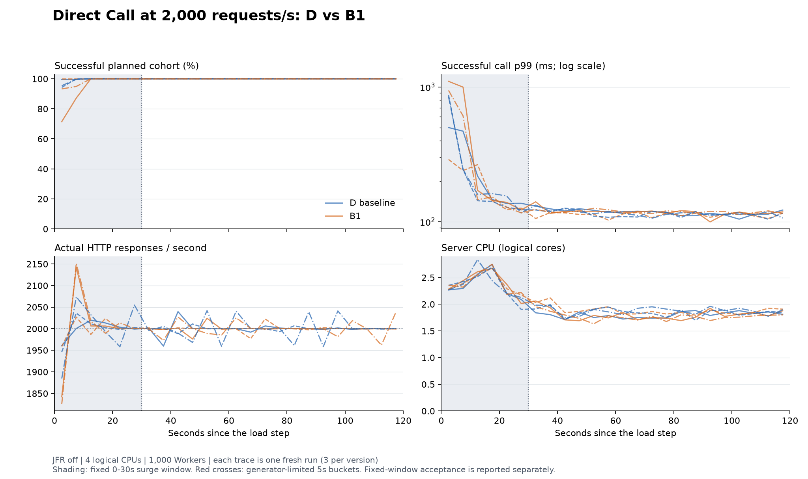
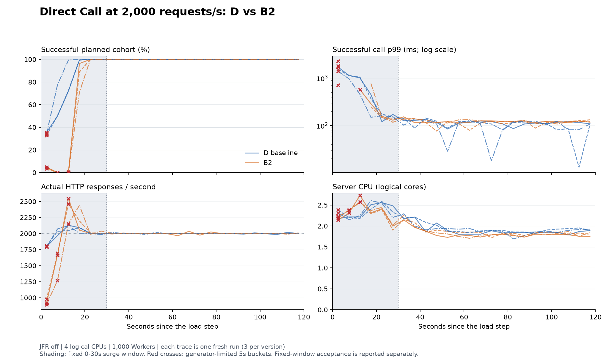

# 2026-09-08：Direct Call 负载突升归因与 HTTP 配置验证

状态：实施与参考主机验收完成。B1、B2 均不保留，生产配置保持 D；独立 JFR、
Task 六例加 Direct 两例的组合验收、完整 Loaded Recovery 均已归档。

## 当前已经可以下的结论

现有 Direct Call 并不存在这份证据所能支持的“不到 1k/s”固定上限。B1 的正式
同机对照中，D 的三次 1k/s 全部成功；三次 2k/s 的后 90 秒也全部成功，共
540,000 次，成功 p99 为 115.9～118.5ms。前 30 秒仍有损失和明显更高的尾延迟，
它与持续阶段应分别判断。

B2 的正式对照再次观察到 D 在三次 2k/s 持续窗口全部成功。两次正式对照中的
六个独立 90 秒窗口合计 1,080,000 次，成功 p99 范围为 113.7～118.5ms；这是
重复的有限窗口证据，不是一段连续长稳运行。B2 的突升窗口均受发压上限影响，
持续窗口没有明确收益，因此也不保留。

把最小驻留线程从 10 提到 200 没有可重复收益，所以 B1 不进入生产配置。
2k/s 突升在第一组变差、第二组改善、第三组没有明确改善；持续阶段的 p99 和
每个 HTTP 响应的 Server CPU 成本也没有达到预设的 15% 改善条件。

## 本轮回答的问题

已有 30 秒证据中，1k/s 的 30,000 次调用全部正确返回；2k/s 最后十秒成功率为
99.98%，早期却有大量槽位拒绝与超时。因此整轮平均成功 QPS 不能当作容量上限。
本轮用同一个客户端连续测量 120 秒，固定前 30 秒观察突升，后 90 秒观察持续阶段；
不在中间收敛或重新预热。每五秒数据及所有原始样本均保留。

API 承载量按实际响应时间统计 HTTP 响应/s；成功调用体验按计划发送批次统计
正确结果比例和成功 p99。HTTP 200 可以携带槽位拒绝或超时。Direct 超时与未知
提交仍是执行未闭合样本，没有补造持久化查询、取消或最终失败语义。

## 可复现版本

- 实施起点：`cd8ebe312591893c1b4277e132e181e008e80855`。
- 不可变基线 D：`8743ff849f55d19a54d0962f5a4898491819b934`。
  虚拟线程关闭，Tomcat 最大 200、最小驻留 10；新增诊断默认关闭。
- B1：`2ce4920177bac568c9c61f25f3b4a57b92549a6e`。
  与 D 仅有一个生产配置差异：最小驻留线程从 10 改为 200。
- 公共 runner 修正：`f83e64233e50e84c15c4d68abf61bcc5f08be4b8`；
  B1 使用相同修正后的提交为 `134e9522dabef426d6bc19c5709df3b4d79a3974`。
  修正只区分正常进程退出与仍存活进程的采样权限错误。D 的生产提交保持不变，
  后续正式对照的 D/B 均由相同修正版 runner 编排；Java Harness 未变。
- [D 的既有 proof CI](https://github.com/quiaingmuarua/xa_mass_platform/actions/runs/34224284853)。
- [B1 首次对照，采样失败保留](https://github.com/quiaingmuarua/xa_mass_platform/actions/runs/34224350612)：
  第一组第四例在 Harness 正常退出期间读取 `/proc/.../fd` 得到 PermissionError，
  按证据契约失败，不计入候选收益或退化验收。原始样本保留，未将其重标为成功。
- [B1 修正 runner 后的正式三组对照](https://github.com/quiaingmuarua/xa_mass_platform/actions/runs/34226208840)。
- [D/B1 独立 JFR 对照](https://github.com/quiaingmuarua/xa_mass_platform/actions/runs/34224402351)。
- B2：`a388136ee02320dfeec60e1ef7b574c9d082712a`，从 D 加上同一公共 runner
  修正形成；唯一生产配置差异是开启虚拟线程，最小驻留仍为 10。
- [B2 正式三组对照](https://github.com/quiaingmuarua/xa_mass_platform/actions/runs/34230406687)。
- [D/B2 独立 JFR 对照](https://github.com/quiaingmuarua/xa_mass_platform/actions/runs/34230473024)。

每次运行使用独立 Server、Host、Redis 和 scope。正式对照固定 Ubuntu 24.04、
4 个逻辑 CPU、Java 21、Redis 7.4.10、DEFAULT Pacer，按 D/B、B/D、D/B 执行。
JFR 另跑一个同机 D/B 诊断对照，不进入正式收益统计。

## 调用链证据如何解释

| 观测 | 能解释的问题 | 不能直接推导的结论 |
| --- | --- | --- |
| HTTP 初次处理、异步完成、实际线程类型 | 初始准入耗时与后续等待是否同时变化 | 异步等待全程占用一个 Tomcat 线程 |
| Binding 与 offer 耗时/状态 | 同步 Owner 操作是否拖长初次请求处理，拒绝是否来自占用槽 | 每个拒绝所对应旧 Command 的执行历史 |
| Adapter 拉取 HTTP 与 Server consume 耗时/批量 | 消费是否减速，延迟是否主要出现在 Owner 调用之外 | 仅用聚合 Redis HRANDFIELD 次数精确代表拉取次数 |
| Report 队列深度、提交/丢弃计数、回传 HTTP 耗时 | 回传是否积压或丢弃 | Direct 超时等价于 Worker 执行失败 |
| HTTP 忙线程/排队、FD、JIT、GC、CPU 栈采样 | 线程扩张、连接增长和运行时活动是否与退化/恢复共时 | 某个相关指标已经被隔离证明为唯一根因 |

Servlet 初次处理事件从 Filter 入口开始，不包含开始执行前的 Tomcat 排队。
JFR 只导出固定类别和安全聚合，没有逐请求跨 Owner 追踪；不同分布的 p99 不能
相减来计算排队时间。阶段耗时是墙钟时间，调用栈数是样本数，均不等同于 CPU
消耗；GC 总事件时间也不能代替停顿时间。Server CPU/HTTP 响应使用进程资源采样，
同时保留采样覆盖时长。虚拟线程模式中不适用的平台池指标输出 null。

## 判定边界

### D/B1 的正式三组对照

12 例均通过运行契约，四个固定保护窗口各有三组有效对照，没有未发出请求。
下表是 2k/s 的计划发送批次结果；每个突升窗口 60,000 次、持续窗口 180,000 次。

| 配对 | 突升成功率 D / B1 | 突升成功 p99 D / B1 | 持续成功率 D / B1 | 持续成功 p99 D / B1 | 持续 Server CPU/HTTP 响应 B1/D |
| --- | --- | --- | --- | --- | --- |
| D/B1 | 99.872% / 93.102% | 368.7 / 891.6ms | 100% / 100% | 118.5 / 118.1ms | 0.994× |
| B1/D | 99.043% / 100% | 532.7 / 239.0ms | 100% / 100% | 115.9 / 112.9ms | 1.015× |
| D/B1 | 99.180% / 98.028% | 547.1 / 641.8ms | 100% / 100% | 116.9 / 118.9ms | 0.954× |

1k/s 的六次 120 秒测量全部成功；两个固定窗口均没有收益或退化判定。
2k/s 突升窗口只有一组改善、一组退化，均未达到需要两组重复的条件；持续窗口
三组均无明确收益。最终分类为 `no_clear_benefit`，不是“已验证无风险”或“已经提速”。

持续窗口按实际响应时刻统计的 HTTP 速率约为 2,000/s；微小超过或低于计划速率
来自跨窗口返回，不能将其算作额外接纳能力。全部测量共 2,160,000 条：成功
2,153,535，槽位拒绝 5,354，超时 1,110，未知提交 1。后两类共 1,111 条逐条保留，
没有将超时记成 Worker 执行失败。Server / Host / Harness 的全阶段线程峰值为
253 / 46 / 27，FD 峰值为 2,393 / 1,027 / 1,346，均低于硬上限。

本次正式 D 的早期退化明显轻于旧 30 秒记录、首次未完成的正式对照及 JFR
诊断。不同 CI 作业不构成同机配对，JFR 也有采集成本；这些差异不能算成
配置收益，也不能算成 JFR 的独立开销测量。公共 runner 修正发生在进程退出采样，
没有改变调用期间的代码。原先严重退化的幅度在这台正式对照主机上没有稳定重现，
这本身是必须保留的归因边界。

### D/B2 的正式三组对照

12 例均通过运行契约。1k/s 的两个窗口及 2k/s 的持续窗口各有三组有效对照，
均没有明确收益；2k/s 突升窗口没有有效配对，最终分类为 `inconclusive`。
下表保留受限窗口原始结果，不用它计算候选容量、收益或退化百分比。

| 配对 | D 突升成功 / 已发出 | B2 突升成功 / 已发出 | B2 未发出 / 计划 60,000 | 配对为何受限 | 持续成功 p99 D / B2 | 持续 CPU/HTTP 响应 B2/D |
| --- | --- | --- | --- | --- | --- | --- |
| D/B2 | 45,694 / 60,000 | 30,085 / 55,964 | 4,036 | D 发送滞后 p99 119.6ms；B2 未发出 | 117.7 / 121.4ms | 0.960× |
| B2/D | 45,510 / 60,000 | 29,189 / 56,774 | 3,226 | B2 未发出 | 113.7 / 121.8ms | 0.954× |
| D/B2 | 51,108 / 60,000 | 27,495 / 54,009 | 5,991 | B2 未发出 | 113.7 / 124.6ms | 0.964× |

这些持续窗口双方均为 180,000 / 180,000 成功。B2 的 CPU 成本下降约 3.6%～4.6%，
成功 p99 上升约 3.1%～9.5%，没有达到保留阈值。1k/s 突升窗口有一组 p99 增幅
超过 20%，另两组没有达到退化线；这也没有构成两组重复的退化判定。

B2 突升中成功样本的 p99 更低，但大量未发出、拒绝与未知提交改变了样本集合。
不能把这个分布单独展示为加速。两版本共 2,160,000 条计划请求：成功 2,029,081，
拒绝 102,728，超时 11,694，未知提交 3,244，未发出 13,253。14,938 条超时/未知
样本保留为执行未闭合；13,253 条未发出均属于 B2 突升阶段。

全阶段 Server 资源峰值也有代价：D / B2 分别为 253 / 56 个原生线程、
3,267 / 5,157 个 FD、969 / 1,428 MiB RSS。原生线程减少验证了执行方式变化，
但没有自动变成调用收益。这里是各版本全例峰值的描述，受限突升不能据此做
精确容量外推；RSS 没有被临时增加为新的硬失败条件。

这次作业中 D 的突升损失又明显增大，而持续阶段仍恢复。它加强了“突升表现
受运行条件影响”的观察，但没有隔离出跨作业差异的原因。严格同机配对依旧只在
各自作业内计算，没有将 B1 作业的 D 与 B2 作业的 B2 拼成更好看的对照。

### D/B1 的独立 JFR 线索

参考 JFR 对照的四例均通过运行契约，三个进程均无记录丢失、聚合溢出或 CPU
覆盖缺口。以下为 2k/s 案例的诊断数据，不进入正式收益对照：

| 观测区间 | D | B1 | 含义 |
| --- | --- | --- | --- |
| 预热末尾 HTTP 池驻留线程 | 14 | 200 | B1 的提前建线程确实生效 |
| 首 5 秒 HTTP 最大忙线程 / 排队 | 200 / 445 | 200 / 884 | 两者仍出现共享 HTTP 执行饱和 |
| 首 5 秒 Direct 初次处理平均耗时 | 59.2ms | 88.4ms | 初始准入本身已经变慢 |
| 首 5 秒 Binding / offer 平均耗时 | 11.1 / 41.6ms | 28.7 / 51.5ms | 同步 Owner 路径存在明显等待/执行成本 |
| 首 5 秒 Adapter 拉取平均 HTTP 耗时 | 137.4ms | 239.6ms | 调用进入与命令取出同时竞争共享路径 |
| 115～120 秒 Direct 初次处理平均耗时 | 2.29ms | 1.68ms | 持续阶段的调用处理已恢复 |
| 首 5 秒 / 115～120 秒 Server FD 峰值 | 3003 / 1321 | 3216 / 1313 | 早期连接扩张与后期回落共时 |

D 首 5 秒只返回 35 个命令拉取批次、2,557 个有效 Worker Command；末 5 秒
返回 1,079 批、10,000 个 Command。两者均未观察到 SERVER Report 入队或回传
丢弃事件。回传变慢确实存在，但本次证据未显示 Report 队列丢弃是主要损失来源。

已验证的机制事实是：Direct 在当前 HTTP 请求中同步读取 Binding，再同步执行
Command offer；offer 使用不可覆盖槽位。未消费槽会拒绝后续针对同一 Worker 的
Direct 请求。Servlet 后续等待是异步的，不能说整段等待都占住一个 Tomcat 线程。

JIT/GC 与早期减速明显共时：D 首 5 秒有 90 个达到 10ms 阈值的编译事件，
GC pause 事件累计约 453ms；末 5 秒分别为 9 个、约 19ms。编译事件耗时可能并发，
不能加总为 CPU 时间或从中断言 JIT 是唯一根因。连接增长也尚未被单独干预验证。
这些都属于相关线索。B1 提前建线程后仍重现早期饱和，说明仅消除线程扩张不足以
消除整个现象；正式三组 JFR-off 对照也没有建立可重复收益。诊断中的饱和说明
这一机制确实发生过，但尚不能量化它对旧 JFR-off 退化的独立贡献。

安全调用栈也支持同步等待路径需要继续分解：D 的突升窗口记录到 41,935 个
结束于 Lettuce `AsyncCommand.await` 的 park 事件；还有 69,520 个来自 Tomcat
空闲取任务的 park 事件。后者不能误报成请求锁竞争，两者的事件数也不是 CPU
占比。CPU 样本可见 JSON 解析/编码、Spring 路由和 HTTP 编码路径；白名单省略的
第三方帧不能据此归为“无成本”，当前样本不支持给每个 Owner 分配精确 CPU 百分比。

归因仍不完整：这些是分阶段的聚合，而非逐请求完整追踪。D 的 2k 诊断窗口
初次 HTTP / 完成事件计数为 307,003 / 307,002，相差一个；仅凭当前聚合不能
分辨耗时反推窗口边界还是缺失事件。保留这一不平衡，不据此承诺逐请求闭合或
计算精确排队时间。JFR 的录制覆盖判据与这种请求级关联完备性分别说明。

### D/B2 的独立 JFR 线索

四例的 Server、Host、Harness 录制覆盖均通过，无 DataLoss、聚合溢出或栈溢出。
B2 的实际初次 HTTP 执行记录为虚拟线程；平台池大小、忙线程与排队量均为 null。
两例 2k/s 的 HTTP 初次/完成聚合分别为 D 的 286,524 / 286,524、B2 的
285,958 / 285,958；仍不把聚合相等当作逐请求跨 Owner 追踪。

| 阶段观测 | D | B2 |
| --- | --- | --- |
| 首 5 秒 Direct 初次处理平均耗时 | 90.3ms | 1,190.5ms |
| 首 5 秒 Binding / offer 平均耗时 | 13.7 / 51.1ms | 771.1 / 241.1ms |
| 首 5 秒 Server consume 平均耗时 | 59.7ms | 220.5ms |
| 首 5 秒 Adapter 拉取平均 HTTP 耗时 | 241.9ms | 1,347.4ms |
| 首 5 秒 Report 回传平均 HTTP 耗时 | 151.6ms | 699.5ms |
| 首 5 秒 GC pause 累计 | 410.1ms | 521.6ms |
| 末 5 秒 Direct 初次处理平均耗时 | 2.35ms | 2.35ms |

B2 首 5 秒还记录了 1,095 个 offer 失败事件。这是固定失败标志，不含异常
分类，不能把它们全称作 Redis 故障或命令过期。当前源码在 Binding 前确定
Command 截止时间，长准入耗时可能影响后续 offer；是否以及多大比例由此触发，
需要下一轮的安全原因分类证据。

替换 HTTP 执行方式没有消除同步 Owner 等待，诊断中等待反而明显出现在
Binding/offer 阶段。两个版本都没有观察到 SERVER Report 入队或提交丢弃。
开启的 pinning 事件阈值为 1ms，本次没有记录到该事件；这不证明不存在短暂
pinning，也不支持将本次退化归给 pinning。以上属于阶段定位与相关线索，
诊断窗口受限且开启 JFR，不参与正式收益判定。

### 候选验收

收益判据、退化判据和资源硬上限沿用
[性能 Owner](../README.md#configuration-candidate-acceptance)。
任何用于定量验收的窗口必须没有未发出请求，且发送滞后 p99 不超过 100ms。
窗口受限不会覆盖其他窗口的原始数据，也不能凭另一个窗口的收益掩盖回归或
未证实的保护窗口。本轮只保留有明确证据的 HTTP 配置；没有合格候选就保留 D。

### 已验证原因、相关线索与尚未解释

- **已验证原因：** 槽位拒绝来自尚未消费的 Command，HTTP Boundary 和 Redis
  Owner 均验证了该非覆盖规则；Direct timeout 来自等待结束，不证明 Worker
  未执行。独立 JFR 场景确实出现共享 HTTP 池饱和、同步 Owner 等待和消费减慢。
  B1 对线程预建进行了单独干预，但正式三组对照没有建立重复收益。
- **相关线索：** JIT、GC 停顿和 FD 扩张与早期减速共时；Lettuce 等待及 JSON/HTTP
  处理出现在安全栈中。它们可以确定后续调查的位置，尚不能按采样数加总为根因贡献。
- **尚未解释：** 旧记录严重退化的幅度为何在其他 CI 作业中减轻；Binding/offer
  墙钟耗时中有多少是客户端排队、Redis 执行、网络调度或编码；恢复后的约 100ms
  尾延迟中各阶段分别贡献多少。当前 100ms Command 空轮询退避是配置事实，
  尚不能仅凭数值接近就把全部 p99 归给它。本轮没有改变这些策略。

1,000 个 Worker 是同一 JVM 中的真实连接，不代表 1,000 台物理设备；2k/s 是
有限调查点，不是生产 SLA。长期运行、跨机网络、真实业务 Handler 和更多 Task/
Group 的性能边界仍需各自有明确目标的 proof。

### 最终取舍

保留 D：`spring.threads.virtual.enabled=false`，Tomcat 最大 200、最小驻留 10。
B1 无重复收益；B2 关键保护窗口受限，其他有效窗口无明确收益。没有候选获准保留，
本轮结束配置筛选，不追加线程数、队列容量或 Pacer 调参。

原 Task 六案例通过组合 nightly 重新运行，覆盖 PRECOMPUTED 共存；本轮没有
对生产配置相同的 D/D 伪造优化三组对照。最终 D 仍补跑完整 Loaded Recovery，
验证新增默认关闭观测点后的有载生命周期与资源约束；结果以下方验收记录为准。

### 最终组合验收的实际表现

参考主机使用最终实现 `3a46d147fc3b5b9c0f312d0c7486ea8804ae2603`，JFR 关闭，
串行运行 Task 六例与 Direct 两例。八例均通过运行契约；这表示前提、关联、
有界补查和资源约束通过，不表示响应内全部成功，也不是一次候选收益对照。

| Task 案例 | 计划 / 发出 | HTTP 响应内成功 | 补查后成功 / failed | 压测端限制 |
| --- | --- | --- | --- | --- |
| ANY 100/s | 3,000 / 3,000 | 3,000 | 3,000 / 0 | 无 |
| ANY 500/s | 15,000 / 15,000 | 6,459 | 15,000 / 0 | 无 |
| ANY 1,000/s | 30,000 / 30,000 | 8,478 | 30,000 / 0 | 无 |
| ANY 2,000/s | 60,000 / 42,847 | 1,982 | 41,873 / 974 | 17,153 条未发出 |
| 指定 Worker 500/s | 15,000 / 15,000 | 8,881 | 15,000 / 0 | 无 |
| 混合负载 500/s | 15,000 / 15,000 | 6,057 | 15,000 / 0 | 无 |

Task 的 2k/s 案例有 42,795 条明确接受，52 条 HTTP 提交结果不确定；后者均在
独立补查中观察到成功，仍保留原提交分类。974 条 failed 是结果投影中的失败记录，
不计成功吞吐；未发出的 17,153 条保持未观察，不是业务失败。全部已接受消息在
预算内得到结果记录。混合例通过后台已开始、测量期间与结束时仍有未完成工作的
Harness 检查，但没有单独导出逐次后台见证时间线。Task 的调用体验仍有明显积压，
不能用 Direct 的持续表现替代它的性能结论。

Direct 1k/s 的 120,000 条全部成功，两个窗口均有效；突升/持续成功 p99 为
130.8/106.1ms。2k/s 的突升窗口有 38,786 次成功、17,199 次槽位拒绝、4,015 次
超时；发送滞后 p99 为 105.5ms，因此该窗口受限，不用于容量或收益验收。
后 90 秒有效，180,000 次全部成功，成功 p99 为 130.6ms。实际 HTTP 响应速率
约 2,000.6/s，包含跨窗口返回，不能将超过计划值的部分算成额外容量。

八例全阶段 Server / Host / Harness 的原生线程峰值为 253 / 46 / 28，FD 峰值为
4,259 / 1,027 / 4,110，均低于该 lane 的硬上限。最后一次 D 的持续 p99 高于前面
两场正式配对作业的 D，进一步说明跨作业数值只能作为趋势，不能拼接成配置收益。

完整 Loaded Recovery 完成 15,000 准备连接到 10,000 保留连接的收缩、一次优雅
重启与两次硬重启。四次变更发生时都有已成功和未完成工作，40 个 Task 共
200,000 个 Item 全部成功且完成结果核对。Host 原生线程峰值 46、FD 峰值 15,027；
Server 原生线程峰值 70、FD 峰值 15,062。每个稳定检查点的三次采样及最终 Host
资源增长也通过该恢复 lane 自己的约束；这些阈值不与性能 lane 互换。

## 可审计证据

- [B1 正式安全聚合与环境、配置、SHA-256](2026-09-08-direct-step-b1-formal.json.gz)。
- [B1 正式未闭合样本](2026-09-08-direct-step-b1-formal-unclosed.jsonl.gz)。
- [B2 正式安全聚合与配置、SHA-256](2026-09-08-direct-step-b2-formal.json.gz)。
- [B2 正式未闭合样本](2026-09-08-direct-step-b2-formal-unclosed.jsonl.gz)。
- [D/B1 JFR 白名单聚合及安全调用栈](2026-09-08-direct-step-b1-diagnostics.json.gz)。
- [D/B1 诊断运行的未闭合样本](2026-09-08-direct-step-b1-diagnostics-unclosed.jsonl.gz)。
- [D/B2 JFR 白名单聚合及安全调用栈](2026-09-08-direct-step-b2-diagnostics.json.gz)。
- [D/B2 诊断运行的未闭合样本](2026-09-08-direct-step-b2-diagnostics-unclosed.jsonl.gz)。
- [首次失败尝试的聚合与失败事实](2026-09-08-direct-step-b1-invalid-attempt.json.gz)
  及其[7,705 条未闭合样本](2026-09-08-direct-step-b1-invalid-attempt-unclosed.jsonl.gz)。
  该尝试仍为 failed，明确排除在候选验收之外。
- [最终八例与四个恢复阶段的安全聚合、配置和 SHA-256](2026-09-08-direct-step-final-verification.json.gz)
  及其 [4,015 条 Direct 未闭合样本](2026-09-08-direct-step-final-unclosed.jsonl.gz)。
  聚合另保留 52 条 Task 提交不确定样本及其后续观察，不改写原 HTTP 分类。

上述完整运行逐条审计了测量和预热样本的计数、ID 唯一性、五秒窗口计数守恒
与全阶段资源上限。原始 JFR 保持私有，完整安全样本在对应 CI artifact 保留七天。
版本化聚合与未闭合样本长期保留，不包含 Worker payload 或结果内容。

## 验证记录

- D 及公共 runner 修正的所有路径选中 lane 已通过。
- [补齐真实 HTTP 结果边界后的 CI](https://github.com/quiaingmuarua/xa_mass_platform/actions/runs/34229913342)
  对应 `aa9d9993026785c731dea8201b6e371fc78e9862`，所有选中 lane 通过。
  JVM Contracts 仍执行原有确定性测试；新 HTTP 配置矩阵属于 Runtime Boundary。
- 本地真实 Redis/HTTP 的 D、B1、B2 三个配置检查通过。B1、B2 的独立候选 checkout
  也分别通过实际执行线程与异步完成检查。它们是功能验证，不是参考主机性能证据。
- [最终实现的既有 CI](https://github.com/quiaingmuarua/xa_mass_platform/actions/runs/34234416420)
  对应 `3a46d147fc3b5b9c0f312d0c7486ea8804ae2603`，所有路径选中 lane 通过，
  包括 JVM Contracts、Redis Owner、Runtime Boundary、Correctness、Dynamic Matching、
  两个 Convergence Health 场景、Android Worker Proof、APK 与分发验证。
  JVM 测试共 913 项（含 17 项调用 Harness 测试），runner 测试 18 项；Redis Owner
  89 项，Runtime Boundary 13 项（含三种 HTTP 配置的成功、拒绝、超时、迟到结果与关闭）。
- nightly shell 的六种调用/失败模式检查通过；
  [组合性能场景参考主机验收](https://github.com/quiaingmuarua/xa_mass_platform/actions/runs/34234445443)
  与[完整 Loaded Recovery](https://github.com/quiaingmuarua/xa_mass_platform/actions/runs/34234451312)
  均通过。版本化聚合保存全部八例及四个恢复阶段的结论和资源审计。
- 现有性能 workflow 已配置北京时间 03:00 串行运行 Task 六例与 Direct 两例，
  JFR 默认关闭；合并至默认分支后由该计划触发。原 Direct 五档、JFR 和三组对照
  继续手动运行，未新增 proof claim 或普通 PR 的绝对 QPS 门禁。
