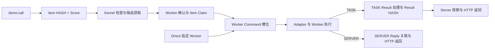
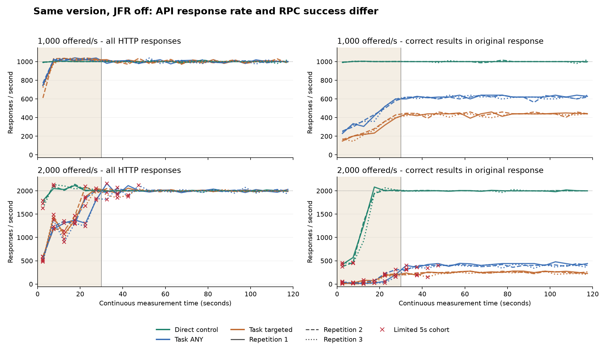
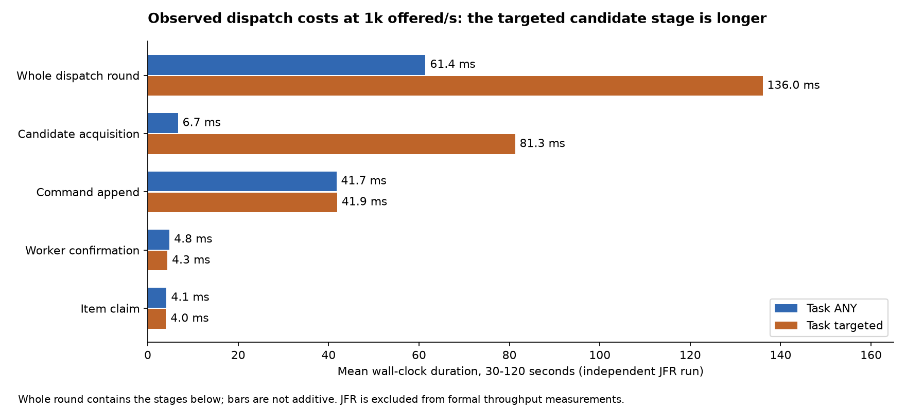

# RPC 主线：默认调度预算与调用链归因

本轮完成主线性能 proof 与归因，没有修改生产配置或调度预算。正式三轮给出的
结论稳定：单 Task ANY 在 500/s 持续窗口全部成功；1k 时 HTTP 仍约 1,000 响应/s，
原响应中的正确调用为 ANY 约 620～628/s、指定 Worker 约 433～446/s。
Direct 控制组在 1k 和 2k 的持续窗口均全部成功。主线的首要限制已定位到单 Task
调度预算与轮内成本；这不是平台只能接收几百个 API 请求/s。

正式运行完成全部 21 例，其中 15 例通过有限测量契约，六个 2k Task 案例失败：
固定补查后仍有 **320,206 个已接受 Item 未观察到 Result**。所有样本保留，不能
宣称 2k Task 容量成立，也没有因 Direct 成功就把失败改判为通过。

## 本轮边界

主线是 `items:call` 提交 ON_DEMAND TaskItem；Direct 作为绕过 Task 调度的控制组。
生产配置、公共 API、Delivery DTO、Redis 存储、Worker 执行语义和 Pacer 策略保持原值。
没有增加 1,000 条调度参数，没有保留新的性能配置候选。

ON_DEMAND 和 PRECOMPUTED 都保存 TaskItem HASH 和调度 Score，区别在候选获取
工作流。Direct 也会经过 Worker Command HASH 槽位；它绕过的是 Task/TaskItem
调度，而不是绕过投递。相同连接数的 Direct 控制组不能代替主线容量证明。

源码基点是 `1c13e4716b256d04fb24b6996f1304feb1cb7336`。
正式实验冻结版本是 `b9b1471d26765cbbbdd3d860e7cbac606b78d9f5`。

## 已由确定性 proof 验证的预算

同一个 Group 的注册调用复用同一个托管 ON_DEMAND Task。每个 Task 每轮最多
检查 100 个 TaskItem；下一次资格从主调度器处理本轮完成后再等待 100ms。
执行慢不会触发并发补跑。因此，持续满批单 Task 的检查预算上界为
`100 / (0.1 + 本轮处理秒数)`。它不是整个平台的全局吞吐上限。

检查 Item、形成候选、Claim、发布 Command 和唯一成功调用分别计数。100 个
Worker 增至 1,000 个连接，并不会改变这个单 Task 的批量与节奏。

对应的可执行证明是
[DispatchBudgetTest](../../../kernel_pacer_jvm/src/test/java/com/xa/mass/kernel/pacer/dispatch/DispatchBudgetTest.java)
和 [同 Group 注册复用测试](../../../server_jvm/src/test/java/com/xa/mass/server/task/call/WorkerGroupTaskCallRegistrationServiceTest.java)。

只要单轮存在非零处理成本，这个单 Task 的持续检查预算就低于 1,000/s。
降低轮内成本仍有价值，但若未来要求单 Task 持续完成 1k～2k 次正确 RPC/s，
就需要另行评估调度预算或工作负载组织，并重新验证语义与资源边界。本轮按已
确认约束保留 100 条与 100ms，不把这次调查包装为已经达到该目标。

## 实验口径

七个主例统一为 Ubuntu 24.04、4 个逻辑 CPU、Java 21、Redis 7.4.10、DEFAULT
Pacer，一个 Group、1,000 个真实 Worker 连接、一个 WebSocket Adapter，全部同机。
每例独立实例，以 100/s 预热 20 秒并收敛，再连续发压 120 秒；前 30 秒和后
90 秒分别报告，同时保留每五秒数据。

正式运行使用同一个版本、关闭 JFR，顺序轮转 Direct/指定 Worker Task/ANY Task。
JFR 七例独立执行。Mixed 保持原 100 Worker、30 秒、500/s，后台 PRECOMPUTED
50,000 Items、100ms Handler、最多 50 candidates，仅用于共存见证。

| 指标 | 含义 |
| --- | --- |
| HTTP 响应/s | 按实际收到响应时间计数，可含 not_observed、拒绝和非成功响应 |
| 原响应成功率 | 按计划到达批次，成功收到正确 MD5 结果数 / 实际发出数 |
| 成功批次/s | 上述批次的成功数 / 发压窗口秒数；可能包含窗口结束后返回的响应 |
| 响应延迟 / 成功调用延迟 | 前者从实际发送计时；后者仅取成功样本，从计划发送计时、含发送滞后 |
| 补查结果 | Task 在最多 180 秒 results:load 内观察到的投影，不重写原始调用延迟 |
| 压测端受限 | 有未发出请求，或发送滞后 p99 超过 100ms；对应窗口不用于容量定量判断 |

HTTP 在途数描述请求尚未返回；`acceptedUnobservedAfterResponses` 描述各原响应
没有观察到结果的数量。两者都不是测量结束瞬间的 TaskItem 积压快照，不能据此
宣称精确排队深度。后续分批补查也不构成跨页面原子快照。

Direct 超时和未知提交仍然未闭合；没有新增取消或持久化补查。Task 失败投影
不算成功，未观察到结果也不等同于 Worker 未执行或 TaskItem Score 最终失败。

## 正式结果

[正式运行 34246407196](https://github.com/quiaingmuarua/xa_mass_platform/actions/runs/34246407196)
在同一 GitHub Ubuntu 24.04.4 / 4 CPU 主机执行，Temurin 21.0.12.1，JFR 关闭。
三个轮次合计计划 3,420,000 次测量请求；任务执行用时 83 分 10 秒，处于
120 分钟预算内。各例启动、准备和预热不进入下面的调用统计。

| 案例 | 有效突升 / 持续窗口 | 持续 HTTP 响应/s | 持续原响应成功率 | 持续成功批次/s | 持续成功 p99 ms |
| --- | --- | --- | --- | --- | --- |
| Task ANY 500 | 3/3 · 3/3 | 499.8～500.1 | 100.00% | 500.0 | 357.3～360.4 |
| Task ANY 1k | 3/3 · 3/3 | 1,000.3～1,001.1 | 61.97～62.81% | 619.7～628.1 | 361.2～367.0 |
| Task 指定 Worker 1k | 3/3 · 3/3 | 999.7～1,001.3 | 43.26～44.56% | 432.6～445.6 | 425.5～483.9 |
| Direct 1k | 3/3 · 3/3 | 999.7～1,000.0 | 100.00% | 1,000.0 | 101.9～104.1 |
| Task ANY 2k | 0/3 · 0/3 | 1,989.4～2,010.2 | 19.65～21.34% | 389.9～426.6 | 1,056.9～1,551.1 |
| Task 指定 Worker 2k | 0/3 · 1/3 | 1,984.3～2,003.4 | 11.93～13.04% | 237.4～260.7 | 1,207.6～1,641.3 |
| Direct 2k | 1/3 · 3/3 | 2,000.0～2,000.5 | 100.00% | 2,000.0 | 111.2～129.7 |

表中范围包含全部三个轮次，受限窗口的数字也保留为观测。2k Task 六例全部硬失败，
即使指定 Worker 的第二轮持续窗口没有发压限制，也不构成该案例验收通过。
500 和 1k 每轮持续窗口分别发出 45,000 和 90,000 个请求。Task ANY 1k 的成功
延迟样本为 56,529 / 55,777 / 55,800 个；指定 Worker 为 39,649 / 40,106 / 38,938
个。表中的较小成功 p99 只描述这些成功者，不能掩盖其他请求没有在原响应中成功。

图按实际响应时间计数；浅色区是前 30 秒，红叉表示对应五秒计划批次受限。
窗口内响应数可能包含此前批次的返回，因此能短时超过固定发压速率。

**如何判断这些数字：** 500/s 已形成当前短 Handler、同机、单 Group 场景下可重复
的良好基线：持续窗口 135,000 个请求全部在原响应中成功，三轮全例 180,000 个
已接受 Item 经补查全部成功。1k Task 的 API 接入可继续工作，但调用体验已经
退化，不能作为“持续 1k 正确 RPC”的验收结果。1k ANY 三轮合计补查成功
294,654 / 360,000（81.85%），失败投影 65,346；指定 Worker 成功
241,912 / 360,000（67.20%），失败投影 118,088。这些失败投影不能计为补查成功；
更长预算内是否出现迟到成功没有验证。

1k Task 的前 30 秒原响应成功率为 ANY 40.52～41.34%、指定 Worker
25.66～28.22%，后 90 秒虽改善，却稳定在上表较低水平。Direct 2k 前 30 秒为
65.55～69.62%，后 90 秒全部成功；其中两轮突升窗口发送滞后 p99 超过 100ms，
所以不能把整个突升损失定量归于 Server。三轮 Direct 2k 共 47,206 次槽位拒绝、
10,952 次超时结果，均不算成功。这里复现的是突升恢复，不是把整轮平均数当容量。

Task 1k 的全部 HTTP 响应 p99 约 2.00～2.01 秒，明显大于只看成功样本的 p99。
配置中的 1 秒是 Server 异步观察等待值，不是从客户端发出开始的硬端到端期限；
初始同步提交、容器异步超时处理与实际 HTTP 返回分开记录。超时回调处理粒度与
排队对这约 2 秒尾延迟的各自贡献尚未独立隔离，本轮没有调整其配置。

2k Task 共 106,018 次未发出和 134 次客户端超时形成的未知提交。后者经公开补查
观察到 29 个成功、4 个失败，另 101 个仍未观察到；原始“提交未知”分类不改写。
六例接受后补查未观察到的数量依执行顺序为
118,111 / 24,290 / 61,807 / 28,128 / 24,973 / 62,897。
未闭合归档共 331,259 条：上述 320,206 条、101 条未知提交和 10,952 条 Direct
超时。没有 429、协议错误或错误 MD5 结果。全量分类与各自分母见附录及安全归档。

| 进程 | 全阶段原生线程峰值 | FD 峰值 | RSS 峰值 MiB |
| --- | --- | --- | --- |
| Server | 254 | 5,195 | 1,525.2 |
| Host | 47 | 1,031 | 365.7 |
| Harness | 27 | 4,110 | 831.8 |

线程和 FD 均未触及 512 / 8,192 硬上限。RSS 作为趋势保留，没有增设内存 SLA。
1k 持续阶段 Server CPU 为 ANY 1.53～1.56 核、指定 Worker 1.50～1.56 核、
Direct 1.68～1.74 核；该进程包含同机 Adapter。CPU/HTTP 响应成本不等于
CPU/成功 RPC 成本，也不能据这几个进程均值推断跨机或多 Task 的容量。

## 阶段归因

独立 JFR 七例已经完成。五例通过运行契约；Task ANY/指定 Worker 的 2k 两例
因固定补查预算后仍有已接受 Item 未闭合而失败。这两例的两个固定窗口均受发压端
限制，因此下面的诊断用于定位成本与等待，不用于计算 2k 服务端容量。

### 已验证的机制与观测位置

默认节奏与批量的约束由确定性 proof 验证。JFR 在持续窗口观察到：

| JFR 案例 | Dispatch 轮数 / 90s | 平均轮内耗时 | 候选获取平均耗时 | Command 追加平均耗时 | 候选 / 检查 Item |
| --- | --- | --- | --- | --- | --- |
| ANY 500 | 684 | 30.5ms | 3.7ms | 19.8ms | 45,006 / 45,006 |
| ANY 1k | 550 | 61.4ms | 6.7ms | 41.7ms | 55,000 / 55,000 |
| 指定 Worker 1k | 377 | 136.0ms | 81.3ms | 41.9ms | 37,629 / 37,700 |

ANY 1k 每轮都检查满 100，候选、Claim 和发布数量一致；约 611 次发布/s 与
`100 / (0.1 + 0.0614)` 的约 620 次检查/s 预算相符。指定 Worker 1k 约 418
次发布/s，同样接近其约 424 次检查/s 的预算。这不是用理论替代实测，也不表示
每个发布都已在原响应中返回。轮次与阶段按各自开始时间分桶，边界上会相差一批。

源码解释了指定 Worker 路径的额外串行成本：Pacer 在每个显式目标 Item 上调用
一次 `observeDueHotScores`，该 Owner 每次执行 ZMSCORE 和 Redis TIME。对 100
个互异单 Worker 目标，仅观察就需要 100 次 Owner 调用。ANY 则一次获取一页。
观察后仍有精确租约确认，不能通过缓存或跳过 Score 检查随意消除这项语义。
这里已验证调用结构与较长阶段同时存在；消除调用后能提高多少端到端吞吐，仍需
下一轮独立候选 proof。

调用结构可从 [Candidate Selection](../../../kernel_pacer_jvm/src/main/java/com/xa/mass/kernel/pacer/dispatch/WorkerCandidateSelectionPolicy.java)
追踪到 [Redis Worker Score Owner](../../../kernel_jvm/src/main/java/com/xa/mass/kernel/score/redis/RedisWorkerScoreCore.java)。

Command 追加是另一项可见成本：当前保留的实现逐 Worker 执行同步 HSETNX，
必要时再一次 HSET 覆盖。原先 Lua 批量候选已在前轮被撤回，本轮没有重新启用。
1k 两例约 42ms 的追加阶段，分别占用 ANY 约 61ms、指定 Worker 约 136ms 轮内
时间的一部分；父子阶段有包含关系，不能把它们当独立开销相加。

跨阶段采样进一步把大量等待定位在 Claim 之前：ANY/指定 Worker 1k 分别有
445/565 个超时采样键，在 HTTP 超时后才开始 Claim；另有 346/647 个键后来
执行了写失败标记的 Owner 调用、没有成功 Claim/Result 链。这些缺段明确保留，
不补造执行过程。写入调用返回不等于逐 Item 的写入生效状态，结果分类以公开
`results:load` 为准。
在有明确两端的样本中，初始化结束到 Claim 的 p99 分别达到 113.9/116.9 秒；
Command 发布到成功 Result 写入开始的 p99 约 270/247ms，成功 Result 写入结束
到 HTTP 观察开始的 p99 约 98/79ms。三个区间样本集不同，绝不能相减或相加来
拼出一条“典型 p99 请求”。

以上支持将单 Task 调度预算和轮内串行成本列为首要排查项。它不支持将这些
超时统一归因为 Worker 的 MD5 执行慢，也不证明平台的全局吞吐上限。

### 相关线索

1k 持续窗口的 Task HTTP 池最大忙线程为 ANY 30、指定 Worker 14，最大排队
分别 47、18；初次处理平均约 4.95ms。此时成功响应比例仍显著低于 Direct，
说明“只把 HTTP 线程池拉高”没有充分依据。

2k Task 的压力更广：两个持续窗口都观察到 200 个忙线程，最大排队 2,469/
2,292；初次处理平均约 46.9/49.0ms。提交阶段、Adapter 拉取、Report 回传以及
观察延迟同时增加。JFR 栈中存在同步 Lettuce 等待、TaskRpcWaitRegistry 锁竞争
和 JSON/字符串处理；这是共享执行资源竞争的线索，并未隔离出唯一根因。
同一诊断中，ANY / 指定 Worker 的平均轮内耗时从 1k 的 61.4 / 136.0ms
增至 2k 的 149.7 / 380.6ms。超载期间轮内工作本身也变慢；发压限制使这些值
只能作为阶段观测，不能据此计算“2k 下的服务端容量”。

Task 结果探测的放大也已量化：1k ANY/指定 Worker 持续窗口分别探测约 118.5万/
157.7万 Item，命中 55,098/37,629；2k 分别约 299.7万/307.9万，命中
34,095/17,406。Item 探测次数包含同一 Item 的重复观察，不能当请求 QPS；最大
256 的单批上限也不是“每 100ms 只能读取 256 个”的固定容量公式。

2k Task 持续 90 秒的 GC pause 事件累计约 5.4/5.7 秒，Direct 为约 0.62 秒。
启动期 JIT 活跃、连接数扩张、锁竞争与延迟同步出现，但采样不构成这些因素的
隔离实验。JIT 事件可并发，不能把总编译耗时当作进程停顿时间。虚拟线程 pinning
在 Task 两例各一条短事件，不足以解释整体退化；HTTP 请求仍使用平台线程。

### 尚未解释与采集边界

2k Task 的 61,788/24,656 个已接受未闭合 Item 保留。当前采集没有读取 Score
私有状态，不能断言每个缺失 Result 都是 TTL 清理积压、没有执行或永久丢失。
TTL 由 Dispatch 在有界检查中处理，不会在截止时自动写出 Result；停止发压后
最多 180 秒的补查既不能改写原调用体验，也不能代表无限等待后的结论。

21 份进程记录均满足覆盖要求，无 JFR data loss、聚合溢出或丢弃调用栈；各 Java
进程均未超过线程/FD 硬上限。完整录制不等于每条调用链完整：五个 Task 案例的
采样缺段、重叠、重复及未闭合数量均在安全聚合中保留。没有跨请求补齐缺段。

每段只关联同一 Server JVM 的已有事件，不跨进程减单调时钟，不减两组 p99。
诊断关联的采样集合按 Server 提交阶段开始时刻筛选，和 Harness 按计划发送
时间划分的请求批次分别报告；末尾在 Server 延后开始的请求不能强行补入关联。
每个区间使用自身两个明确边界，不因 HTTP 已超时而丢弃前段样本；重复、缺段、
重叠和超界均保留计数。批量追加尚未返回时，前面的 Command 可能已经被消费。
所以 Owner 调用前后时间不等于每个 Item 的 Redis 提交瞬间。

## 八案例组合验收与定时启用条件

[手动运行 34249751418](https://github.com/quiaingmuarua/xa_mass_platform/actions/runs/34249751418) 以同一冻结版本、JFR 关闭执行全部八例，6 例通过、2 例失败；接受后补查未观察到的 Item 共 76,684 个。该工作流使用另一台同规格 runner，不并入同机正式三轮的范围。执行用时 29 分 43 秒，未超过 45 分钟预算。

| 案例 | 状态 | 发出 / 计划 | 原响应成功率 | 接受后补查成功 / 失败 / 未观察 |
| --- | --- | --- | --- | --- |
| rpc-any-500 | passed | 60,000 / 60,000 | 99.94% | 60,000 / 0 / 0 |
| direct-step-1000 | passed | 120,000 / 120,000 | 100.00% | 不适用 |
| rpc-targeted-1000 | passed | 120,000 / 120,000 | 43.51% | 85,108 / 34,892 / 0 |
| rpc-any-1000 | passed | 120,000 / 120,000 | 61.76% | 101,992 / 18,008 / 0 |
| direct-step-2000 | passed | 240,000 / 240,000 | 93.57% | 不适用 |
| rpc-targeted-2000 | failed | 226,084 / 240,000 | 13.70% | 81,189 / 85,900 / 58,991 |
| rpc-any-2000 | failed | 226,520 / 240,000 | 21.63% | 112,621 / 96,199 / 17,693 |
| mixed-500 | passed | 15,000 / 15,000 | 31.14% | 15,000 / 0 / 0 |

Mixed 的运行状态为 `passed`，发压端受限为 `false`。它使用原始 100 Worker / 30 秒 / 500/s 配置，后台仍是 50,000 个 PRECOMPUTED Item、100ms Handler、最多 50 candidates。该状态包含后台成功启动、测量期间非终态与未完成工作见证的既有断言，不表示已执行完全部后台任务，也不参加 1,000 Worker 主例的路径比值。

Mixed 共 4,671 / 15,000 个调用在原响应中成功（31.14%，155.7/s），补查成功 15,000 / 15,000。这证明本次共存负载能在预算内闭合，但多数在线调用需要后续观察，不能称为 500/s 即时成功。两个 2k Task 持续窗口在这次运行没有发压限制，仍因整例的 Result 未闭合失败。

新组合未通过固定验收，**没有启用新定时组合**。北京时间 03:00 的现有工作流继续串行运行原 Task 六例和 Direct diagnosis 两例；新的 `--suite nightly` 八例保留手动入口。未改变负载、补查预算、判据或生产配置来让案例通过。

## 验证与证据

- 实施版完整路径 CI：34246405758，932 JVM、89 Redis Owner、13 Runtime Boundary
  测试均通过，另有 21 项 Python runner 测试；Correctness、Dynamic Matching、
  Convergence Health、Android Worker、Runtime/SDK Distribution 均通过。
- JFR：34246399753，已完成七例，两个 2k Task 案例按固定补查条件失败。
- 正式三次测量：34246407196，21 例全部完成，15 例通过，六个 2k Task 案例失败。
- Nightly 八例组合：34249751418，八例全部完成，6 例通过，2 例失败；新定时组合未启用。
- 早期诊断运行 34245410868 因发现“返回 Map 大小误当命中数”而主动停止；
  34245865619 在开始正式测量前取消。修正版测试以一个成功投影加一个 null
  投影证明探测命中应为 1，未改变业务观察与重试。早期数据不进入正式结论。

安全原始样本、资源数据与配置来自独立工作流，保留七天；版本化报告已归档
必要聚合与校验和。原始 JFR 留在私有目录，不上传 payload、结果内容或执行 journal。

正式 21 例与 JFR 七例的有效 Server 配置已逐例归一化核对：除独立 Redis 地址、
scope 和 JFR 开关外一致，均为同一冻结版本、1,000 Workers、120 秒、4,096 在途
和 1 秒等待。归档另从安全原始样本重算身份唯一性、计数守恒、30/90 秒结果分类，
以及每五秒的实际发出、HTTP 返回和成功返回数，全部与 Harness 汇总一致。

执行版的最外层失败字符串把“完整 manifest 内有失败案例”误写成
`Incomplete or duplicate performance case manifest`。原证据不改写；上述独立
校验确认正式 21 例和诊断七例成员完整，真正失败原因来自对应 case-summary。
收尾修正了这个文案并新增案例完成日志，仍维持非零退出和全部原判据，没有
改变发压、补查或结果分类。

收尾提交只修正汇总说明、保留原定时组合并加入这些归档；正式实验版本继续冻结为 `b9b1471d`。最终提交的路径 CI 由 [PR #36 的检查](https://github.com/quiaingmuarua/xa_mass_platform/pull/36/checks) 单独记录。

## 下一轮与未证明边界

下一轮优先验证指定 Worker 候选观察的有界批量化，以及 Command 发布阶段的
串行调用成本；必须保留每个 Item 的目标优先顺序、Worker 唯一性和精确租约
确认。Result 观察放大与 HTTP 共享资源竞争列为随后需要隔离的线索。本轮不
改变这些实现，也不提高批量、频率、线程、队列或等待预算来获得更好的数字。
此前被否决的 Command Lua 候选不会因为这次出现追加耗时就自动恢复；任何新候选
仍需同时证明 Owner 成本、主线调用体验和共存负载没有退化。

当前证据不覆盖物理 1,000 台设备、跨机网络、
长期运行、大量活跃 Task/Group、公平性或新的调用语义，不设生产 QPS SLA。

## 正式三轮计数附录

| 轮次 | 案例 | 状态 | 发出 / 计划 | 原响应成功 / 未观察 | HTTP 接受: 补查成功 / 失败 / 未观察 | 未知提交 / 未发出 |
| --- | --- | --- | --- | --- | --- | --- |
| 1 | rpc-any-500 | passed | 60,000 / 60,000 | 59,909 / 91 | 60,000: 60,000 / 0 / 0 | 0 / 0 |
| 1 | direct-step-1000 | passed | 120,000 / 120,000 | 120,000 / 0 | 不适用 | 0 / 0 |
| 1 | rpc-targeted-1000 | passed | 120,000 / 120,000 | 47,347 / 72,653 | 120,000: 80,966 / 39,034 / 0 | 0 / 0 |
| 1 | rpc-any-1000 | passed | 120,000 / 120,000 | 68,684 / 51,316 | 120,000: 98,340 / 21,660 / 0 | 0 / 0 |
| 1 | direct-step-2000 | passed | 240,000 / 240,000 | 221,774 / 0 | 不适用 | 0 / 0 |
| 1 | rpc-targeted-2000 | failed | 224,028 / 240,000 | 26,460 / 197,502 | 223,962: 43,955 / 61,896 / 118,111 | 66 / 15,972 |
| 1 | rpc-any-2000 | failed | 221,034 / 240,000 | 40,589 / 180,414 | 221,003: 103,809 / 92,904 / 24,290 | 31 / 18,966 |
| 2 | rpc-any-500 | passed | 60,000 / 60,000 | 59,941 / 59 | 60,000: 60,000 / 0 / 0 | 0 / 0 |
| 2 | rpc-targeted-1000 | passed | 120,000 / 120,000 | 48,573 / 71,427 | 120,000: 81,970 / 38,030 / 0 | 0 / 0 |
| 2 | rpc-any-1000 | passed | 120,000 / 120,000 | 68,178 / 51,822 | 120,000: 98,278 / 21,722 / 0 | 0 / 0 |
| 2 | direct-step-1000 | passed | 120,000 / 120,000 | 120,000 / 0 | 不适用 | 0 / 0 |
| 2 | rpc-targeted-2000 | failed | 224,978 / 240,000 | 25,732 / 199,225 | 224,957: 77,650 / 85,500 / 61,807 | 21 / 15,022 |
| 2 | rpc-any-2000 | failed | 223,903 / 240,000 | 40,037 / 183,863 | 223,900: 102,123 / 93,649 / 28,128 | 3 / 16,097 |
| 2 | direct-step-2000 | passed | 240,000 / 240,000 | 220,740 / 0 | 不适用 | 0 / 0 |
| 3 | rpc-any-500 | passed | 60,000 / 60,000 | 59,765 / 235 | 60,000: 60,000 / 0 / 0 | 0 / 0 |
| 3 | rpc-any-1000 | passed | 120,000 / 120,000 | 68,036 / 51,964 | 120,000: 98,036 / 21,964 / 0 | 0 / 0 |
| 3 | direct-step-1000 | passed | 120,000 / 120,000 | 120,000 / 0 | 不适用 | 0 / 0 |
| 3 | rpc-targeted-1000 | passed | 120,000 / 120,000 | 46,815 / 73,185 | 120,000: 78,976 / 41,024 / 0 | 0 / 0 |
| 3 | rpc-any-2000 | failed | 217,743 / 240,000 | 36,926 / 180,806 | 217,732: 99,758 / 93,001 / 24,973 | 11 / 22,257 |
| 3 | direct-step-2000 | passed | 240,000 / 240,000 | 219,328 / 0 | 不适用 | 0 / 0 |
| 3 | rpc-targeted-2000 | failed | 222,296 / 240,000 | 23,889 / 198,405 | 222,294: 75,280 / 84,117 / 62,897 | 2 / 17,704 |

| 案例 | 发出 / 计划 | 成功 | 失败 | 未观察 | 拒绝 | 超时结果 | 未知 | 未发出 | 429 | 客户端超时 | 协议错误 |
| --- | --- | --- | --- | --- | --- | --- | --- | --- | --- | --- | --- |
| rpc-any-500 | 180,000 / 180,000 | 179,615 | 0 | 385 | 0 | 0 | 0 | 0 | 0 | 0 | 0 |
| rpc-any-1000 | 360,000 / 360,000 | 204,898 | 0 | 155,102 | 0 | 0 | 0 | 0 | 0 | 0 | 0 |
| rpc-targeted-1000 | 360,000 / 360,000 | 142,735 | 0 | 217,265 | 0 | 0 | 0 | 0 | 0 | 0 | 0 |
| direct-step-1000 | 360,000 / 360,000 | 360,000 | 0 | 0 | 0 | 0 | 0 | 0 | 0 | 0 | 0 |
| rpc-any-2000 | 662,680 / 720,000 | 117,552 | 0 | 545,083 | 0 | 0 | 45 | 57,320 | 0 | 45 | 0 |
| rpc-targeted-2000 | 671,302 / 720,000 | 76,081 | 0 | 595,132 | 0 | 0 | 89 | 48,698 | 0 | 89 | 0 |
| direct-step-2000 | 720,000 / 720,000 | 661,842 | 0 | 0 | 47,206 | 10,952 | 0 | 0 | 0 | 0 | 0 |

## 版本化安全证据

- [正式 21 例的分窗、五秒分桶、配置与资源聚合](2026-09-09-rpc-mainline-formal.json.gz)。
- [正式运行的 331,259 条未闭合安全样本](2026-09-09-rpc-mainline-formal-unclosed.jsonl.gz)。
- [独立七例 JFR 白名单聚合与安全调用栈](2026-09-09-rpc-mainline-diagnostics.json.gz)。
- [独立 JFR 运行的 91,335 条未闭合安全样本](2026-09-09-rpc-mainline-diagnostics-unclosed.jsonl.gz)。
- [八案例组合的配置、资源与测量聚合](2026-09-09-rpc-mainline-nightly.json.gz)。
- [八案例组合的未闭合安全样本](2026-09-09-rpc-mainline-nightly-unclosed.jsonl.gz)。
- [冻结实施版的 CI 状态与 JUnit 计数](2026-09-09-rpc-mainline-ci.json)。
- [上述证据和两张图的 SHA-256](2026-09-09-rpc-mainline-SHA256SUMS.txt)。

压缩 JSON 可用 Python 标准库 `gzip` 与 `json` 读取；它保留原始失败状态、采样限制和缺段计数。未闭合样本含关联 ID、时间与状态，不含 Worker payload、结果内容或完整执行 journal。完整安全原始样本仍在各运行七天的 artifact 中。
